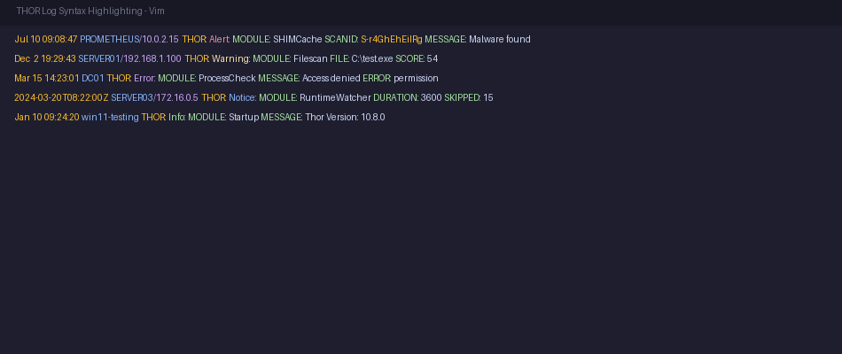
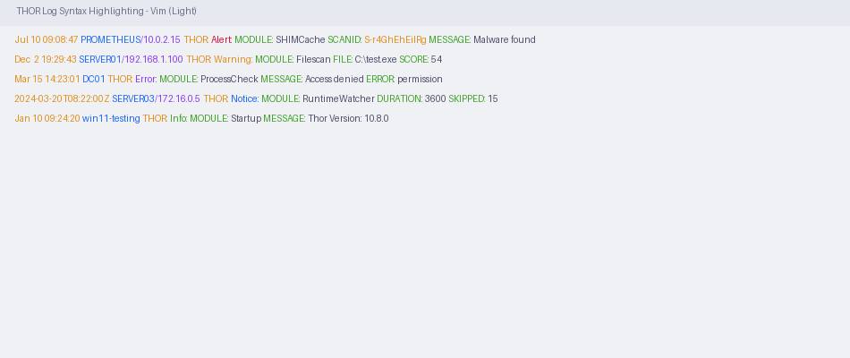

# THOR Log — Vim / Neovim

Syntax highlighting for [THOR APT Scanner](https://www.nextron-systems.com/thor/) text log files.

## Preview

| Dark Theme | Light Theme |
|------------|-------------|
|  |  |

## Installation

### Using a Plugin Manager (Recommended)

#### vim-plug

Add this line to your `~/.vimrc` (between `call plug#begin()` and `call plug#end()`):

```vim
Plug 'Nextron-Labs/thor-syntax-highlighting'
```

Then restart Vim and run `:PlugInstall`.

To update after changes:
```vim
:PlugUpdate
```

#### lazy.nvim (Neovim)

Add this to your plugin list in `~/.config/nvim/lua/plugins.lua` (or equivalent):

```lua
{ "Nextron-Labs/thor-syntax-highlighting" }
```

Then restart Neovim or run `:Lazy sync`.

#### Vundle

Add this line to your `~/.vimrc` (between `call vundle#begin()` and `call vundle#end()`):

```vim
Plugin 'Nextron-Labs/thor-syntax-highlighting'
```

Then restart Vim and run `:PluginInstall`.

### Manual Installation

Copy the files to your Vim runtime directory:

```bash
# Vim
mkdir -p ~/.vim/syntax ~/.vim/ftdetect
cp vim/syntax/thorlog.vim ~/.vim/syntax/
cp vim/ftdetect/thorlog.vim ~/.vim/ftdetect/

# Neovim
mkdir -p ~/.config/nvim/syntax ~/.config/nvim/ftdetect
cp vim/syntax/thorlog.vim ~/.config/nvim/syntax/
cp vim/ftdetect/thorlog.vim ~/.config/nvim/ftdetect/
```

### File Association

The filetype detection automatically activates for:

- Files with extensions `.thor.log` or `.thor.txt`
- Files matching `*_thor_*` or `*_THOR_*` patterns (e.g. `ion.local_thor_2026-01-21_1914.txt`)
- Any `.log` or `.txt` file whose first 20 lines contain `THOR:` or `THOR_UTIL:` followed by a log level

To force the syntax on any file:

```vim
:set filetype=thorlog
```

## What Gets Highlighted

| Element | Highlight Group | Default Color |
|---------|----------------|---------------|
| Timestamps | `thorTimestamp` → `Number` | Magenta/Yellow |
| Hostnames | `thorHost` → `Identifier` | Cyan |
| Hostname/IP | `thorHost` + `thorHostIP` → `Constant` | Cyan + Red/Magenta |
| Source (`THOR:`) | `thorSource` → `Keyword` | Yellow |
| Alert | `thorLevelAlert` | 🔴 Red (bold) |
| Error | `thorLevelError` | 🟣 Purple |
| Warning | `thorLevelWarning` | 🟡 Yellow |
| Notice | `thorLevelNotice` | 🔵 Blue |
| Info | `thorLevelInfo` | 🟢 Green |
| Field keys | `thorFieldKey` → `Type` | Green |
| Hashes | `thorHash*` → `Special` | Magenta |
| IP addresses | `thorIPAddress` → `Constant` | Red/Magenta |
| Scan IDs | `thorScanID` → `Constant` | Red/Magenta |
| Numbers | `thorNumber` → `Number` | Magenta/Yellow |

Colors adapt to your colorscheme. The syntax uses standard Vim highlight groups with explicit fallback colors for log levels.
